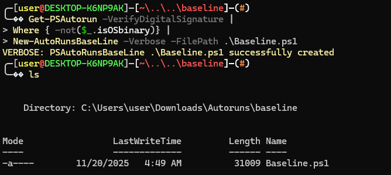
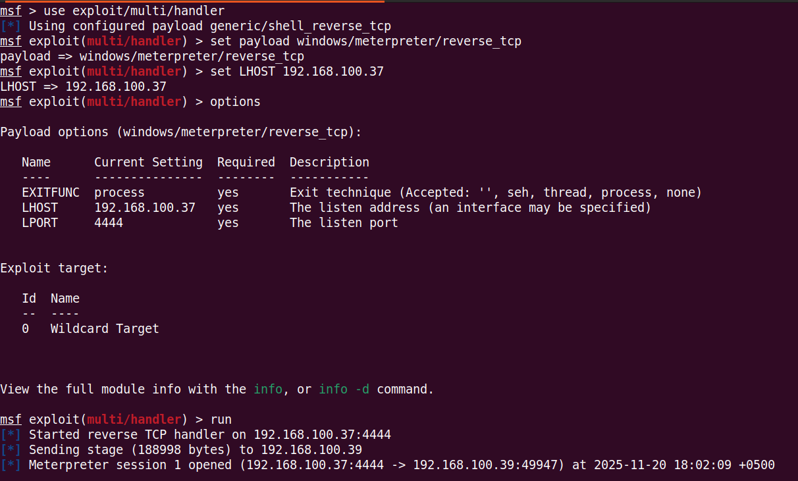
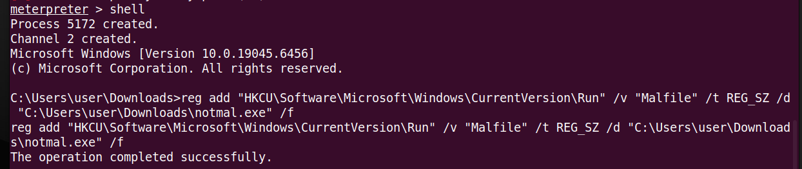
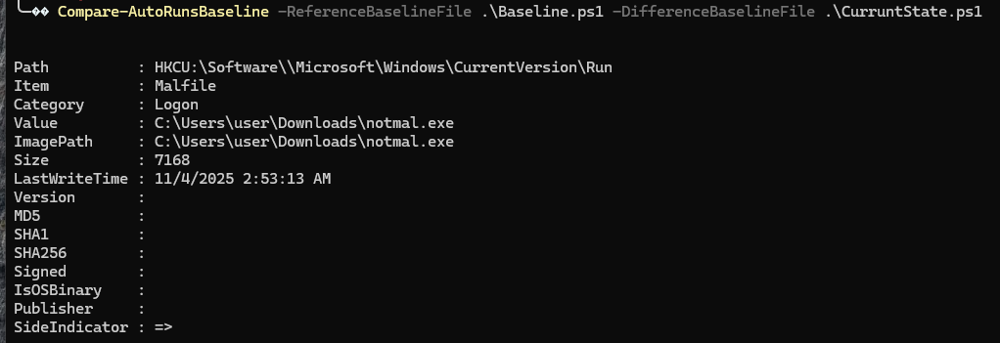

# **Windows Autoruns Baseline**

This project focuses on detecting Windows persistence by creating and comparing Autoruns baselines. I performed the lab on a Windows 10 Enterprise VM and used an Ubuntu attacker machine running Metasploit to simulate malicious activity.

---

## **Overview**

In this Project I wanted to understand how attackers abuse Windows startup locations to maintain persistence, and how a defender can detect those unauthorized changes. To do this, I used the Autoruns PowerShell module from the p0w3rsh3ll GitHub repository. I first created a clean baseline from my Windows VM, then introduced a malicious persistence entry through a registry modification, and finally compared both states.

By doing this, I simulated a real SOC workflow: establish known-good behavior, detect a deviation, and investigate whether that deviation could represent malicious persistence.

---

## **What is Autoruns**

Autoruns is a Sysinternals tool that shows every program, DLL, script, or component configured to start automatically on Windows. This includes:

- Registry Run keys
- Winlogon entries
- Image Hijacks
- Scheduled Tasks
- Drivers and Services
- Explorer Add-ons
- WMI persistence
- Office add-ins
- LSA providers and more

The PowerShell module I used exposes these same categories through cmdlets like `Get-PSAutorun`, `New-AutoRunsBaseline`, and `Compare-AutoRunsBaseline`.

SOC analysts and DFIR responders often rely on Autoruns during investigations because persistence is a common attack technique. Anything that starts automatically is worth reviewing, especially if it appears suddenly or does not match the expected baseline of a system.

---

## **Why Persistence Matters**

Persistence allows an attacker to survive system reboots or user logouts.

Typical persistence goals:

- maintain backdoor access
- restart malware after reboot
- load malicious DLLs silently
- run scripts at logon
- disguise payloads as legitimate startup components

Registry Run keys are one of the most widely abused methods. For example:

```
HKCU\Software\Microsoft\Windows\CurrentVersion\Run
```

Any value created here will automatically run every time the user logs in.

This is exactly the technique I tested in this project.

---

## **What is a Baseline**

A baseline is a snapshot of how the system normally looks when clean.

In this case, my baseline included:

- all existing Startup/Run keys
- valid signed executables
- expected system components
- normal scheduled tasks
- clean drivers and services

Once I had this baseline saved, any new entry that appeared later could be compared directly against the original state. This is the same process SOC analysts use when investigating possible malware persistence.

---

## **Lab Setup**

**Windows 10 Enterprise VM**

Used as the victim endpoint where I captured baseline and current state.

**Ubuntu Attacker VM (Metasploit)**

Used to simulate attacker actions and trigger persistence changes.

**Sysinternals Autoruns + Autoruns PowerShell Module**

I downloaded the module from the official repository:

p0w3rsh3ll/AutoRuns

**Registry modification via reg add command**

Used to simulate a malware-style Run key entry.

---

## **Baseline Creation**

I started by importing the AutoRuns PowerShell module inside my Windows VM. Before creating the baseline, I inspected the module to understand what commands it exposed.

```
Get-Module
Import-Module '.\AutoRuns (1).psm1'
Get-Module -Name "AutoRuns (1)"
Get-Command -Module "AutoRuns (1)"

```

Once I verified the commands were available, I generated the clean baseline that represented my system before any persistence was added.


---

## **Creating the Baseline (Clean System State)**

After importing the module, I generated a clean baseline from my Windows VM. This captured all existing autorun entries before any changes were made. I used the following command:

```powershell
Get-PSAutorun -VerifyDigitalSignature |
Where { -not($_.isOSbinary)} |
New-AutoRunsBaseLine -Verbose -FilePath .\Baseline.ps1
```

This created a PowerShell baseline file called `Baseline.ps1` under my baseline directory. This file represented the “known-good” state of my system, and later I used it as the reference point to detect changes.



---

## **Attacker Simulation from my Ubuntu VM**

To simulate malicious activity, I used my Ubuntu VM running Metasploit. The idea was to replicate a realistic attacker step where malware modifies the victim machine’s registry to add persistence.

In my case, I opened Metasploit (`msfconsole`) to simulate an active attacker session and prepared for the next step.




Even though I did not rely on Metasploit for the final persistence action, it represents the attacker foothold before persistence modification.

---

## **Adding a Persistence Mechanism**

The persistence technique I chose was a simple Registry Run key. This is a very common method seen in real incidents because anything placed here launches automatically whenever the user logs in.

I executed this command on the Windows VM:

```powershell
reg add "HKCU\Software\Microsoft\Windows\CurrentVersion\Run" /v "Malfile" /t REG_SZ /d "C:\Users\user\Downloads\notmal.exe" /f
```

This created a new autorun entry named `Malfile` pointing to a suspicious binary (`notmal.exe`).




From a SOC perspective, a new entry suddenly appearing in the Run key is already suspicious. If the file is unsigned, lives in a strange directory, or has no publisher information, it becomes an immediate IOC that needs to be investigated.

---

## **Capturing the Current State**

After adding the malicious autorun, I generated a second baseline to represent the modified environment:

```powershell
Get-PSAutorun -VerifyDigitalSignature |
Where { -not($_.isOSbinary)} |
New-AutoRunsBaseLine -Verbose -FilePath .\CurrentState.ps1
```

This file now contained both the original entries and the new malicious one. The goal was to compare this against the clean baseline to detect unauthorized persistence.

---

## **Comparing Both Baselines**

With both the clean baseline (`Baseline.ps1`) and the modified state (`CurrentState.ps1`) created, the next step was to compare them. The AutoRuns module includes a built-in comparison function that highlights any differences between the two snapshots.

I used the following command:

```powershell
Compare-AutoRunsBaseline -ReferenceBaselineFile .\Baseline.ps1 -DifferenceBaselineFile .\CurrentState.ps1
```

This command compared all autorun entries from before and after the attacker added persistence. It produced a clear diff, showing exactly what changed.




---

## **Identifying the Suspicious Entry**

The comparison revealed a new entry under the Registry Run key:

```powershell
Path          : HKCU:\Software\Microsoft\Windows\CurrentVersion\Run
Item          : Malfile
Category      : Logon
Value         : C:\Users\user\Downloads\notmal.exe
ImagePath     : C:\Users\user\Downloads\notmal.exe
Signed        :
IsOSBinary    :
Publisher     :
SideIndicator : =>
```


This immediately stood out because:

- The file lived in a Downloads directory
- There was no Publisher information
- The binary was unsigned
- The entry did not exist in the clean baseline
- The name “Malfile” does not match any legitimate application

The `SideIndicator` arrow showed that this entry existed **only** in the modified baseline, confirming it was introduced after the attacker activity.


---

## **SOC Perspective**

From a SOC analyst’s point of view, this is exactly what you want to find when you suspect persistence:

- A new Run key linked to a non-Microsoft binary
- Located in a user-writable path
- No digital signature
- No appearance in any earlier baselines or golden images

This kind of behavior maps directly to MITRE ATT&CK technique **T1547.001 Registry Run Keys**.

In a real investigation, the next steps would be:

- Calculate the file hash
- Check for detections in EDR or SIEM logs
- Look for related processes or network activity
- Capture memory and disk artifacts if needed

In my case, detecting this new entry confirmed that my controlled persistence test succeeded.

---

## **Validating the Suspicious File**

Once I confirmed the persistence entry was added, I validated the malicious file itself. Even though this was a controlled test, I treated it exactly how I would in a real SOC investigation.

I checked the hash:

```
Get-FileHash "C:\Users\user\Downloads\notmal.exe" -Algorithm SHA256

```

I also checked whether the file was signed:

```
Get-AuthenticodeSignature "C:\Users\user\Downloads\notmal.exe"

```

As expected:

- The file was **unsigned**
- The hash did not match anything legitimate
- It was running from a user directory (never a good sign)

This validated that the new autorun entry was indeed pointing to a suspicious executable added post-baseline.

---

## **MITRE ATT&CK Mapping**

The behavior observed in this project aligns directly with:

### **T1547.001 – Registry Run Keys / Startup Folder**

Attackers commonly abuse the following registry paths to achieve persistence:

- `HKCU\Software\Microsoft\Windows\CurrentVersion\Run`
- `HKLM\Software\Microsoft\Windows\CurrentVersion\Run`

In this test, the attacker added:

```
HKCU Run → Malfile → notmal.exe

```

This mapped perfectly to the persistence tactics taught in SOC101 and is often used in malware like RATs, keyloggers, and loaders.

---

## **Why Baselines Matter in SOC & DFIR**

In real SOC work, having a known-good baseline helps with:

### **1. Faster Detection**

Instead of manually hunting through hundreds of autorun entries, you instantly see:

- what was added
- what was removed
- what changed

This dramatically reduces analyst workload.

### **2. Incident Validation**

If an alert fires for “Suspicious persistence technique added,” a baseline gives you evidence to confirm or dismiss the alert.

### **3. Threat Hunting**

Good baseline files help identify:

- unexpected DLLs
- unsigned files
- weird registry values
- anomalous scheduled tasks
- unauthorized scripts

Baseline comparisons also become part of long-term host integrity monitoring.

---

## **Final Summary of My Investigation**

Here’s what I did from start to finish:

- Set up a Windows VM and a Kali/Ubuntu VM (with Metasploit)
- Installed SysInternals Autoruns and imported the PowerShell module
- Verified module commands using `Get-Module` and `Get-Command`
- Created a clean autoruns baseline using `New-AutoRunsBaseline`
- Simulated an attacker adding persistence through `reg add`
- Captured the modified state as `CurrentState.ps1`
- Compared both baselines with `Compare-AutoRunsBaseline`
- Identified the malicious autorun registry entry
- Validated the file hash and signature
- Mapped findings to MITRE ATT&CK
- Documented everything along with screenshots

This project replicates a real SOC workflow and demonstrates both analytical and hands-on investigative skills.

---

## **Conclusion**

This project showed how powerful autorun baselines are when detecting persistence techniques on Windows systems. By comparing snapshots before and after simulated attacker activity, I was able to immediately identify a suspicious autorun entry and validate it with SOC investigation techniques.

Even though this was a lab, everything I did here reflects real-world work:

establishing baselines, detecting anomalies, verifying artifacts, and documenting findings. This is the same approach used in incident response, threat hunting, and SOC operations.
